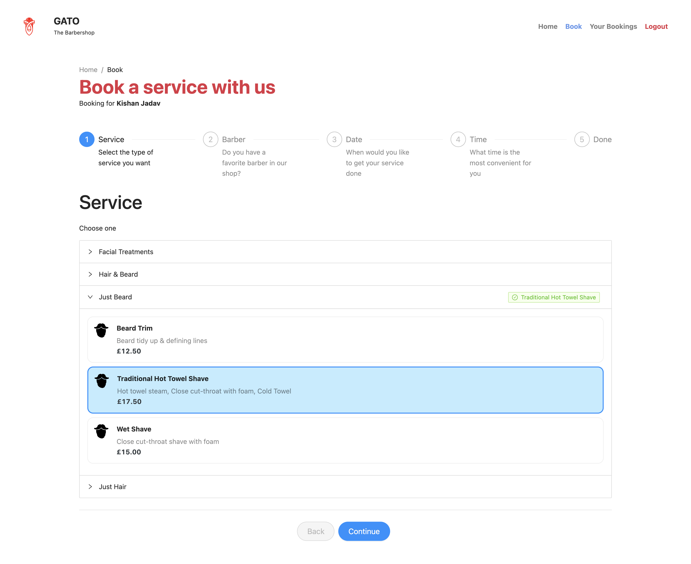
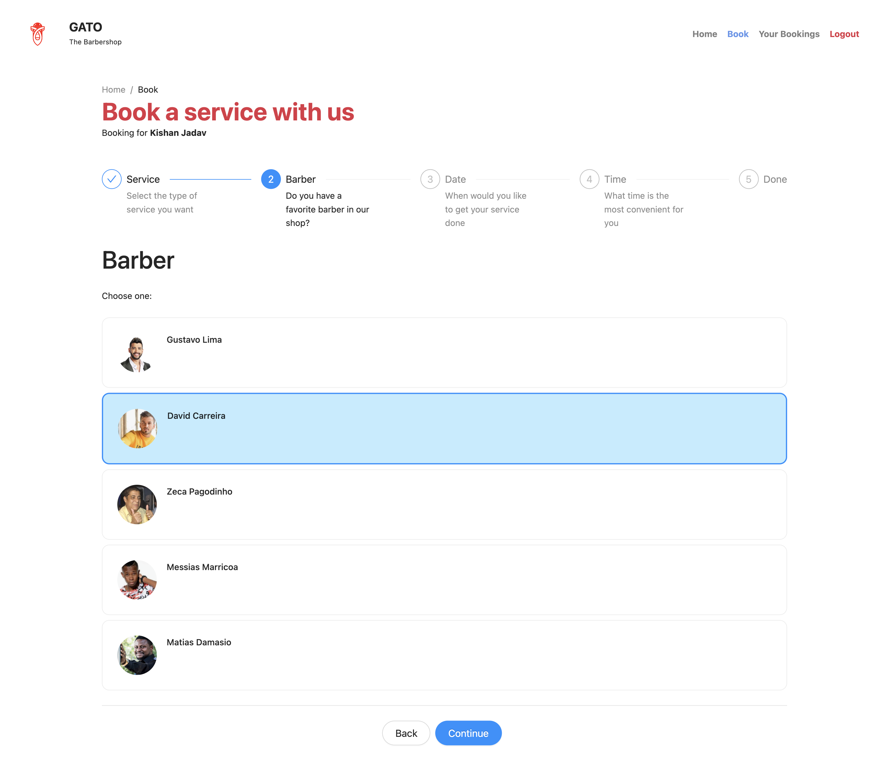
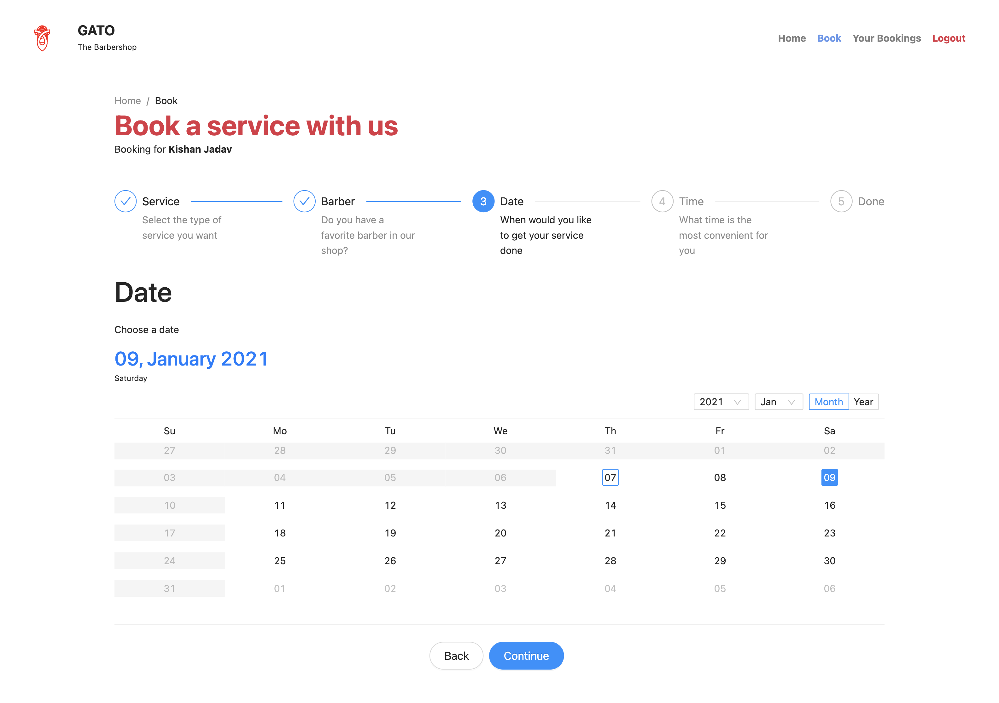
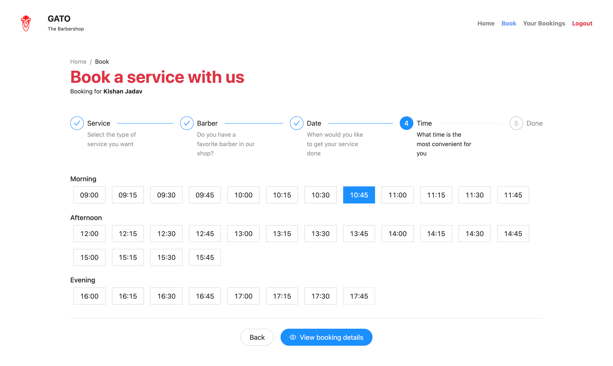
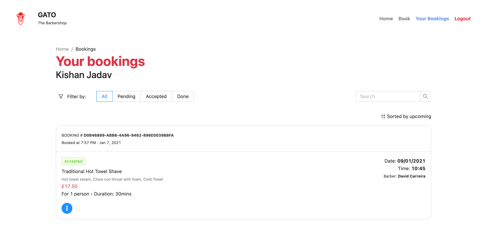
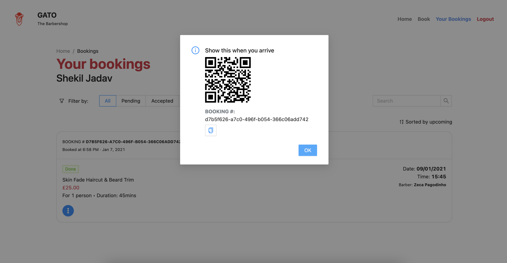
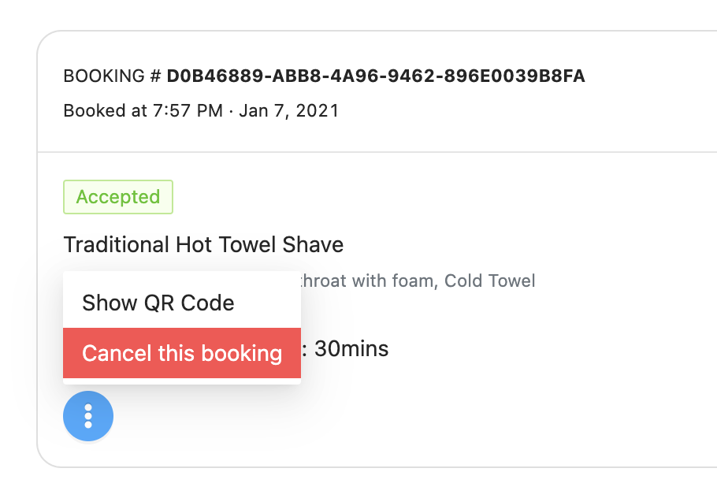
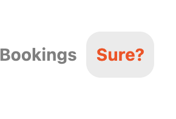
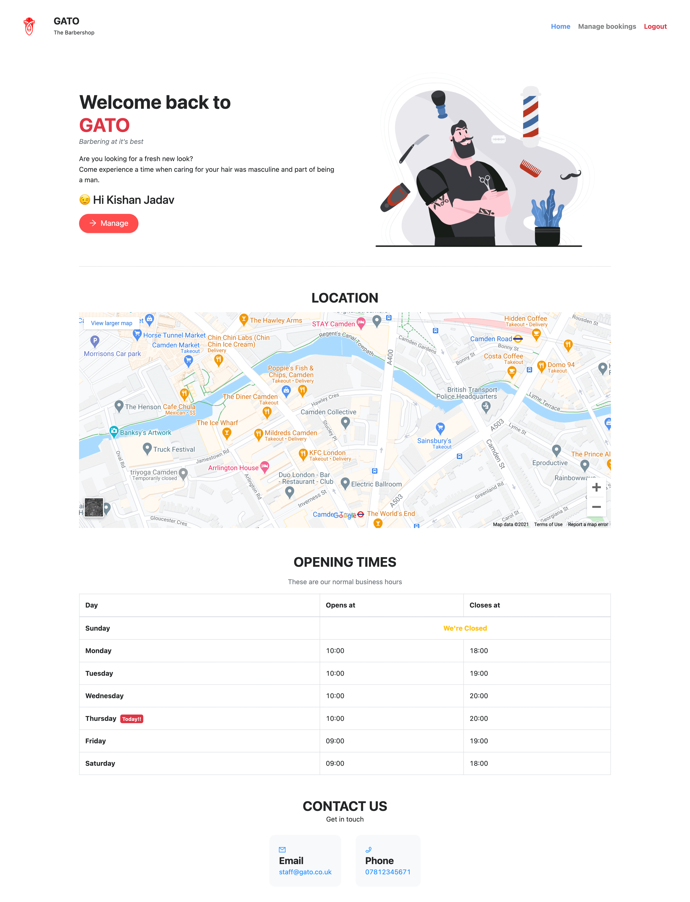

# Final Project (Capstone)

- [GATO: The barbershop](#gato:-thebarbershop)
  - [Motivation](#motivation)
  - [Technologies used](#technologies-used)
  - [Project requirements](#project-requirements)
  - [Key features](#project-features)
  - [Justification](#justification)
- [How to Build and Run](#how-to-build-and-run)
- [Usage](#usage)
- [API](#api)
- [Source code tree (with descriptions)](#source-code-tree-with-descriptions)


### GATO: The barbershop
For the final project I've designed and implemented a dynamic website of my own, drawing upon all of the course’s lessons and my own understandings.

#### Motivation
Before the pandemic hit, whenever we needed to go for a haircut, we would go to the shop and if all barbers were busy we would need to wait until our opportunity came. Imagine this shop full of people waiting. Nowadays this is very risky of contamination because of the shop's limited size, as this means that we all stay very close to one another waiting in cues inside the shop just because we don't want to lose our turns.

With this app, anyone can book a service (e.g: haircut) that this barbershop offers right from the comfort of their own house or wherever they are, for any day and time of that day. And just like that, we prevent big cues and we know exactly at what to time to arrive for our turn.

View the app demo: [https://youtu.be/HX1vCRPW4lk](https://youtu.be/HX1vCRPW4lk)


#### Technologies used:
- [Python (vers. 3.9.1)](https://python.org)
- [Django](https://djangoproject.com/)
- [Javascript (ES6) with Linter](https://developer.mozilla.org/en-US/docs/Web/JavaScript)
- [ReactJS](https://reactjs.org/)
- [Sass](https://sass-lang.com/)
- [Bootstrap (vers. 5.0.0-beta1)](https://getbootstrap.com/)
- [Ant Design Framework (vers. 4.9.4)](https://ant.design/)

#### Project requirements
:white_check_mark: Must be sufficiently distinct from the other projects in this course. [<i><small>See my [Justification](#justification)</small></i>].<br>
:white_check_mark: Utilizes Django (with at lease one model) on the back-end and JavaScript on the front-end.<br>
:white_check_mark: All pages are mobile responsive.


#### Key features
:star: ReactJS as frontend UI.<br>
:star: Authenticate as a staff or as a user.<br>
:star: Book an appointment as a user.<br>
:star: View own bookings as a user.<br>
:star: QRCodes for identifying bookings!<br>
:star: Manage staff as administrator.<br>
:star: Manage services as administrator.<br>
:star: Manage business hours as administrator.<br>
:star: Manage appointments as staff or administrator.<br>
:star: API!<br>
<small>*View all features by watching the demo video linked above.*</small>


#### Justification
How in the world is my final project different from the previous projects:
- The Django User model has a custom authentication backend and user model manager.
- Supports image uploads through Django's admin panel.
- Uses [ReactJS](https://reactjs.org) for all the frontend UI, and only communicates with the backend via the API.
  - No page reloads because of [react-router](http://reactrouter.com/): which uses [Hash Router](https://reactrouter.com/web/api/HashRouter) and [Hisory API](https://developer.mozilla.org/en-US/docs/Web/API/History_API) to allow page navigation.
  - Uses [Fetch API](https://developer.mozilla.org/en-US/docs/Web/API/Fetch_API) for all Frontend-Backend communications.
  - Makes use of an existing React UI Framework called [ant.design](https://ant.design) mixed with the latest version of the well estabilished CSS framework [Bootstrap](https://getbootstrap.com/docs/5.0/).
  - Uses community shared node packages, installed via NPM 🖤.
- [Webpack](https://webpack.js.org) for bundling and transpiling ([Sass](https://sass-lang.com), [JSX](https://reactjs.org/docs/introducing-jsx.html), Javacsript, Images and SVG's).
- [ES Modules](https://nodejs.org/api/esm.html#esm_introduction), transpiled by Webpack.
- Uses device's camera to scan QrCodes.
- [ESLint](https://eslint.org/) ftw! A very productive editor tool for quickly analyzing code, finding problems and fixing them!
- Custom django-admin commands. <small>Used for importing starter data, such as the staff and the services the shop provides.</small>

<br>

## How To Build and Run
1. Clone this repo.
2. Navigate into the project `finalproject` directory.
3. Create a Virtual Environment and activate it:
```bash
  # Create
  python3 -m venv venv

  # Activate:
    # macOS
    source venv/bin/activate
    # Or Windows
    venv\Scripts\activate.bat
```

4. Install all of the required python dependencies:
```bash
  pip install -r requirements.txt
```

5. Install all of the required Node dependencies via:
```bash
  # Important: We use the --legacy-peer-deps options to resolve dependencies version issues
  npm install --legacy-peer-deps
```

6. Bundle our source's JS, Images and SCSS files using webpack via npm:
```bash
  # One time (recommended for demo):
  npm run dev

  # Or watch (recommended for development):
  npm run dev-watch
```

7. Make database migrations:
```bash
  python manage.py makemigrations
```

8. Migrate:
```bash
  python manage.py migrate
```

9. Import starter data:
   
    ><small><i>These are essential data which includes: the shop's business hours, the staffs and the services it provides.<br>Noting that this data can be added manually via the Django's Admin Panel, I have just made it easier for us by writing this django-admin commands to get started.</i></small>
```bash
  # Run this in order
  # 1. Import the business hour data:
  python manage.py import businesshours
  # 2. Import the barbers data:
  python manage.py import barbers
  # 3. Import the service types data:
  python manage.py import servicetypes
  # 4. Import the services data:
  python manage.py import services
```

10. Create a superuser to manage the admin pages
```bash
  python manage.py createsuperuser
  # Then follow the instructions.
```

11. And finally start the Django web server
```bash
  python manage.py runserver
```

12. Navigate to the URL provided by the command above and you should be redirected to the Home page! ✅


## Usage
When the user opens the index page (`/`), he will be presented with the Home Page. Every page has a top navigation bar which changes according to the location the user is in.

> Note that every route url has a preceding "hash" which has the effect of all subsequent URL path content being ignored in the server request (i.e. you send "http://localhost/#/book" the server gets "http://localhost/"). As a result the server will return the pre # URL response, and then the post # path will be handled and parsed by the client side react app, with the use of React Router (see [React HashRouter](https://reactrouter.com/web/api/HashRouter)), loading the correct page component accordingly.

#### Home page – /


The home page contains a quick way to book an appointment, displays the location of the shop using the [embeded Google Maps](https://support.google.com/maps/answer/144361?co=GENIE.Platform%3DDesktop&hl=en#:~:text=Embed%20a%20map%20or%20directions&text=the%20embedded%20map.-,Open%20Google%20Maps.,Click%20Embed%20map.) which is interactive. Next it shows a table listing the opening times, and just bellow some contact informations with quick links.

By entering their email into the input at the top, the user will be automatically redirected to the login page (if they have an account), otherwise to the account registration page. It is also possible to get to the session page via the login button in the navigation bar on top.


#### Session – /session


If the user already have an account, he may login using email and password. Otherwise, an account can be created from the register tab.


To register the user is asked to enter their First and Last name, as well as their email address and a password of their choosing. Upon registration/login the user is redirected to the [Home page](#home-page-–-) (if they come to the session page by tapping the Login button on the nav bar) or the Book page (if they came via the Book Now button in the Home page).

The authentication is secure and validated upon every request.


#### Book – /book



This page allows the user to book a service to the shop in 5 steps, by choosing the kind of service, a barber, a date and a time. Starting with the service selection as shown in the screen capture above. The navigation to the next page is done via the **Continue** button on the bottom of the page.



The user can also go back a step and ammend a selection with the use of the **Back** button that is also on the bottom of the page. The image above shows the selection of a barber in step 2 of booking a service.



After the selection of a barber, the user will select a date when the service will be done. They are only allowed to choose a date on which the barbershop is open. "Today" is pre-selected or indicated with a blue border around. The user selected date is shown with a solid blue background. 



The time selection is straightforward and divided into time of day groups for easy selection. They are only allowed to select from the time the barbershop opens until 15mins earlier than the closing time.

After selecting the time, the user will click on the **View booking details** button to, surprisingly, view the booking details huh.


In here they will be presented with an overview of the selections made and may optionally add any note for the barber. After that, confirm the booking to process.


After confirming the booking, a [QR code](https://en.wikipedia.org/wiki/QR_code) will be generated and some informations for the user. All of the bookings are saved on the user's account and can be viewed by the user when authenticated, in the [User's Bookings](#user-bookings-–-bookings) page.

#### User Bookings – /bookings



On this page, all of the user's bookings are listed and individually detailed. They can filter it by the booking status, or by searching. There are 4 booking status: Accepted, Done, Cancelled or Rejected.

- Accepted: The booking has been succesfully accepted and registered.
- Done: Service and payments has been made.
- Cancelled: User canceled the booking.
- Rejected: Barbershop has rejected the booking. This can be due to emergency situations, i.e. the barbershop has to close unexpectedly.

By tapping the booking #, the user can view the QR code used to show the barber on site. This can also be achieved by pressing the blue Options button located at the bottom of each booking listing.






There is also a booking cancelation option for when the user gets second thoughts about their booking.

#### Logout – /logout

The user can logout from their account by clicking on the logout button available at the navigation bar on top of the page. A confirmation will be asked after clicking the logout button, to prevent accidentally loging out :)




#### Barbershop Staff and SuperUsers (manage barbers or shop) – /manage

Every barber has a staff account that can login and manage the bookings on the shop. They can mark the bookings as Done or even Reject.




There is an admin panel, which only the superuser can access at `localhost/admin`.


## API

Because the api documentation was so big, I moved it into a separate file to keep things neat. [`📄 Read API.md`](API.md#api)


## Source code tree (with descriptions).
- 🗂 `capstone/` – Main app dir
  - 🗂 `management/commands/` - My custom Django-admin commands.
    - 🗂 `data/` - Contains `📄 *.csv` files with the data to be imported by the commands. Also contains a `🗂 photos/` folder which contains staff photos to be uploaded.
    - 📄 `_utils.py` - Utility functions specific to the commands.
    - 📄 `_businesshours.py` - command used to import starter business hours data from the `businesshours.csv` file located in the data directory, to the database table.
    - 📄 `_services.py` - command used to import starter services data from the `services.csv` file located in the data directory, to the database table.
    - 📄 `_servicetypes.py` - import starter service types data from the `servicetypes.csv` file located in the data directory, to the database table.
    - 📄 `_barbers.py` - import starter staff data from the `staffs.csv` file located in the data directory, to the database table.
    - 📄 `import.py` - command used to import starter data to the database table from the file located in the data directory. For usage, see [step 9 on <strong>How To Build and Run</strong>](#how-to-build-and-run).
  - 🗂 `migrations/` - Database migration files
  - 🗂 `mycontrib/`
    - 📄 `auth.py` - Custom Authentication Backend, which enables the use of email field to login, instead of Username.
    - 📄 `usermanager.py` - Custom User Model, which enables the use of email address to create  users.
  - 🗂 `src/` – Frontend (React)
    - 🗂 `components/` - React components
      
      - 🗂 `manage/` – React components specific to the Book page.
        - 📄 `ManageBookings.js` – Manage bookings component
      
      - 🗂 `book/` – React components specific to the Book page.
        - 📄 `Barbers.js` – To show and allow barber selection for booking.
        - 📄 `BookResult.js` – To show the result of booking.
        - 📄 `Dates.js` – To show and allow date selection for booking.
        - 📄 `Services.js` – To show and allow service selection for booking.
        - 📄 `Times.js` – To show and allow time selection for booking.
      - 📄 `Logout.js` – Logout button react component
      - 📄 `Logout.stylesheet.scss` – Stylesheet for the logout button component
      - 📄 `NavBar.js` – Navigation react component
      - 📄 `NavBar.stylesheet.scss` – Stylesheet for the navigation component
      - 📄 `StatusTag.js` – Reusable tag with colors automatically set for each type of status.
      
    - 🗂 `hooks/` - My custom react hooks
      - 📄 `usePrevious.js` – A custom hook to keep track of previous values before change. Useful for tracking state chage.
      - 📄 `useQuery.js` – A custom hook that builds on useLocation to parse the query string.
      - 📄 `useUser.js` – A custom hook that builds on useLocalStorage to retrieve, parse and save the currently logged in user from local  storage.
      
    - 🗂 `images/` - Images, such as logos and banners used in frontend.
    
    - 🗂 `pages/` - Main page react components
      
      - 🗂 `admin/` - Admin or Staff only pages components
        - 📄 `Manage.js` – /manage page react component.
      - 📄 `Book.js` – /book page react component.
      - 📄 `Book.stylesheet.scss` – Stylesheet for the book page component.
      - 📄 `Bookings.js` – /bookings page react component.
      - 📄 `Bookings.stylesheet.scss` – Stylesheet for the bookings page component.
      - 📄 `Home.js` – Home page react component.
      - 📄 `NoMatch.js` – Page Not Found react component.
      - 📄 `Session.js` – Session page react component, for login and register ui.
      
    - 🗂 `utils/` – My JavaScript helper functions
      - 📄 `dateToNum.js` – A custom js module for converting a formated date string (removing "/") into a number. <i>E.g: `"04/01/2021"` into `04012021`.</i>
      - 📄 `EmailValidator.js` – A custom js module for validating an email address form.
      
    - 📄 `App.js` – Main react component.
    
    - 📄 `index.js` – React app entrypoint.
    
    - 📄 `Index.stylesheet.scss` – Global stylesheet (available to all components)
  - 🗂 `static/capstone/` – Webpack bundled static files (such as scripts, stylesheets and images) output folder. Compiled source code.
  - 🗂 `templates/capstone/` – Django's template directory.
    - 📄 `index.html` – Application main index html that is rendered via Django's view and loads our bundled script file.
    - 📄 `layout.html` – Base template. index.html extends it.
  - 📄 `__init__.py` – Python file to treat the directory containing it as a python module.
  - 📄 `admin.py` – Used to register and display my models in Django's admin panel.
  - 📄 `apps.py` – App configurations.
  - 📄 `models.py` – My app models.
  - 📄 `tests.py` App tests (untouched).
  - 📄 `urls.py` – App urls.
  - 📄 `utils.py` – My custom python utility functions.
  - 📄 `views.py` – App views for the urls.
- 🗂 `finalproject/` – Project dir containing project configurations.
- 🗂 `media/` – Uploaded media files directory
- 📄 `.babelrc` – [Babel](https://babel.io) configurations
- 📄 `.eslintrc` – [ESLint](https://eslint.org/) configurations
- 📄 `package.json` – [NPM](https://npmjs.com) package manager file
- 📄 `requirements.txt` – Required python dependency list
- 📄 `webpack.config.js` – [Webpack](https://webpack.js.org) configurations

<br>

> You may also find:
> - 🗂 `node_modules/` in the root directory – This contains all node modules installed via NPM. You can ignore this directory.
> - 🗂 `__pycache__/` inside some directories – This is basically becuase when you run any program in python, the interpreter compiles it to bytecode first (this is an oversimplification) and stores it in the __pycache__ folder. You can ignore this directory and the files contained in it too.
> - 🗂 `venv/` in the root directory – This is the virtual environment directory we created earlier in the setup.


## Footnote
I am proud of the effort I put in this project. Thank You.