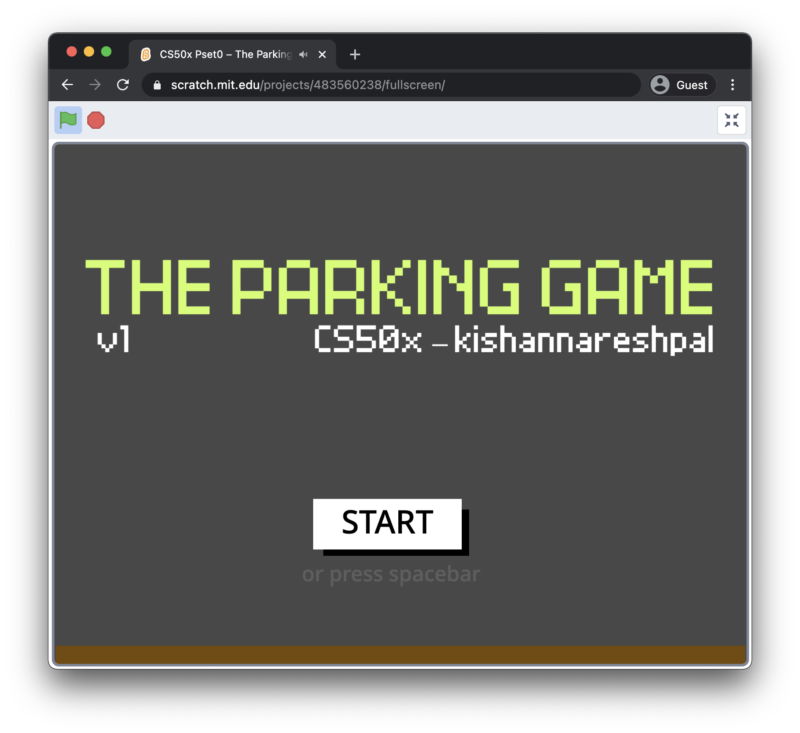
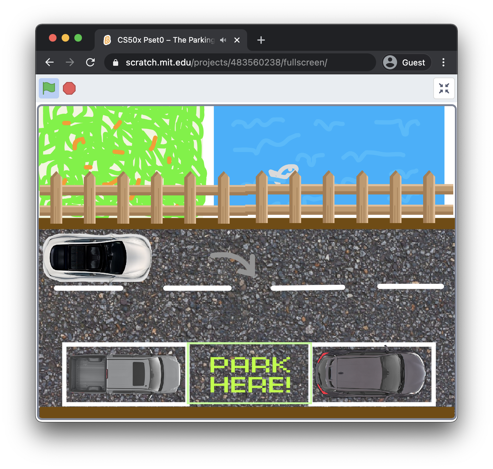

# Problem Set 0

### The parking game

For this project I've made a parking game using the visual programming langugage [Scratch](https://scratch.mit.edu).

Play it now at [https://scratch.mit.edu/projects/483560238/](https://scratch.mit.edu/projects/483560238/)

\

#### Technologies Used
- [Google Chrome](https://chrome.google.com)
- [Scratch – The visual programming language](https://scratch.mit.edu)

#### Project Requirements

:white_check_mark: Must have at least two sprites, at least one of which must resemble something other than a cat.\
:white_check_mark: Must have at least three scripts total (i.e., not necessarily three per sprite).\
:white_check_mark: Must use at least one condition.\
:white_check_mark: Must use at least one loop.\
:white_check_mark: Must use at least one variable.\
:white_check_mark: Must use at least one sound.\
:white_check_mark: Should be more complex than most of those demonstrated in lecture (many of which, though instructive, were quite short) but it can be less complex than [Ivy’s Hardest Game](https://scratch.mit.edu/projects/326129587/). As such, this project should probably use a few dozen puzzle pieces overall.

#### Contributing

To open `📄 theparkinggame.sb3` file simply go to [https://scratch.mit.edu], **Create** a new project, click on **File** and select **Load from your computer**. Once prompted by your computer, choose the `*.sb3`.